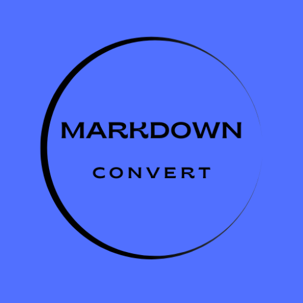

# Ì∫Ä Markdown Converter App

**Convert plain text to GitHub flavored Markdown** with real-time preview and PWA support.



## ̺ê Live Demo
[](https://marceloadan73.github.io/markdown-converter)

## ‚ú® Features
- ‚úÖ **Real-time conversion** - Text to GitHub Markdown
- ‚úÖ **PWA support** - Install as native app (Ì≥• icon in browser)
- ‚úÖ **Desktop version** - Electron app for Windows/Mac/Linux
- ‚úÖ **GitHub-style preview** - Exact GitHub rendering
- ‚úÖ **Dark/Light mode** - Toggle between themes
- ‚úÖ **Responsive design** - Mobile, tablet, desktop
- ‚úÖ **Quick formatting** - Toolbar for common markdown
- ‚úÖ **Copy to clipboard** - One-click copy formatted markdown
- ‚úÖ **Statistics** - Character/line count in real-time

## ̪†Ô∏è Technologies
- **React 18** + **TypeScript** - Frontend framework
- **Electron** - Desktop application
- **Custom CSS** - No frameworks, pure CSS
- **Workbox** - PWA service workers
- **Create React App** - Build tooling

## Ì≥¶ Installation

### Option 1: Web PWA (Recommended)
1. Visit the [Live Demo](https://marceloadan73.github.io/markdown-converter)
2. Look for the Ì≥• install icon in your browser's address bar
3. Click "Install Markdown Converter"
4. Use it as a native app (works offline!)

### Option 2: Local Development
```bash
# Clone repository
git clone https://github.com/MarceloAdan73/markdown-converter.git
cd markdown-converter

# Install dependencies
npm install

# Development (web only)
npm start
# Open: http://localhost:3000

# Development with Electron
npm start
# Opens both: React dev server + Electron window

# Production build
npm run build
npx serve -s build -l 5000
# Open: http://localhost:5000 (with PWA support)

